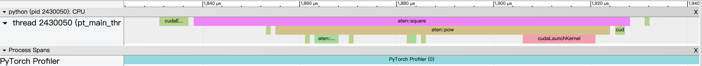
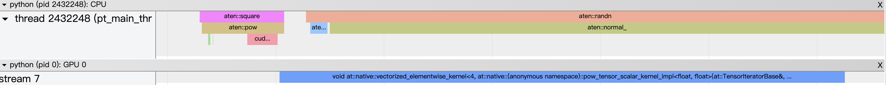
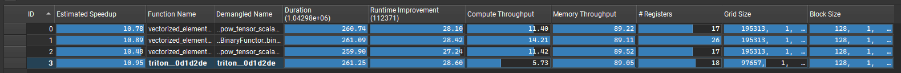
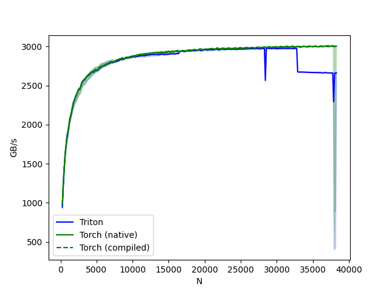

# 初识典型框架语言的使用方法及分析手段

本节将通过一个简单的 element-wise 的例子（矩阵平方），来展示不同框架如何进行GPU编程，并分析其性能。

## 1. PyTorch 的实现与profile

### 1.1 PyTorch 的原生实现
- 代码：pytorch_square.py
- 命令：python pytorch_square.py

PyTorch 可通过三种方式实现矩阵平方操作：内置函数、pow 函数、mul 函数，以及 compile 特性。
```
torch.square(a)
def square_2(a):
    return a * a
def square_3(a):
    return a ** 2
compiled_square = torch.compile(torch.square)
```
使用`cuda.Event`记录执行时间
```
def time_pytorch_function(func, input):
    # CUDA IS ASYNC so can't use python time module
    start = torch.cuda.Event(enable_timing=True)
    end = torch.cuda.Event(enable_timing=True)

    # Warmup
    for _ in range(5):
        func(input)

    start.record()
    func(input)
    end.record()
    torch.cuda.synchronize()
    return start.elapsed_time(end)

b = torch.randn(10000, 10000).cuda()
print(f"square time used: {time_pytorch_function(torch.square, b)} ms")
print(f"square 2 time used: {time_pytorch_function(square_2, b)} ms")
print(f"square 3 time used: {time_pytorch_function(square_3, b)} ms")
```
在 H100 中结果如下所示：
```
square time used: 0.26956799626350403 ms
square 2 time used: 0.2685759961605072 ms
square 3 time used: 0.2667199969291687 ms
compiled square time used: 0.26764801144599915 ms
```
#### **PyTorch 的 profile 工具**
接下来生成 profile 文件,以内置函数为例
```
with torch.autograd.profiler.profile(use_cuda=True) as prof:
    torch.square(b)
prof.export_chrome_trace("logs/square.json")
print(prof.key_averages().table(sort_by="cuda_time_total", row_limit=10))
```
可以在`chrome://tracing/`中加载查看profile文件，如下：

打印出来的结果如下所示
```
-------------------------  ------------  ------------  ------------  ------------  ------------  ------------  ------------  ------------  ------------  ------------  
                     Name    Self CPU %      Self CPU   CPU total %     CPU total  CPU time avg     Self CUDA   Self CUDA %    CUDA total  CUDA time avg    # of Calls  
-------------------------  ------------  ------------  ------------  ------------  ------------  ------------  ------------  ------------  ------------  ------------  
                aten::mul         8.36%      23.000us        12.73%      35.000us      35.000us     298.000us       100.00%     298.000us     298.000us             1  
          cudaEventRecord         2.91%       8.000us         2.91%       8.000us       4.000us       0.000us         0.00%       0.000us       0.000us             2  
         cudaLaunchKernel         4.36%      12.000us         4.36%      12.000us      12.000us       0.000us         0.00%       0.000us       0.000us             1  
    cudaDeviceSynchronize        84.36%     232.000us        84.36%     232.000us     232.000us       0.000us         0.00%       0.000us       0.000us             1  
-------------------------  ------------  ------------  ------------  ------------  ------------  ------------  ------------  ------------  ------------  ------------  
Self CPU time total: 275.000us
Self CUDA time total: 298.000us
```
如果希望看到更多信息可以使用（pt_profiler.py）
```
with profile(activities=[ProfilerActivity.CPU, ProfilerActivity.CUDA]) as prof:
    for _ in range(10):
        a = torch.square(torch.randn(10000, 10000).cuda())

prof.export_chrome_trace("logs/trace.json")
```
可以清楚看到，计算重复了10次，且第一次warmup的时间明显更长

展开其中一条记录，可以看到所用的核函数及其所用时间


#### **ncu 分析工具的使用**
profile 可以分析计算的过程与状态，如果要更加细致分析算子计算情况，则需要`ncu`工具。对于以上四种实现，可以通过ncu生成profile，如下：
```ncu -o pytorch --set full python pytorch_ncu.py```
其中，`--set full`表示生成详细的profile，`-o pytorch`表示将profile保存到`pytorch`文件中。生成的profile文件可以通过`ncu`工具查看。

可以看到前3种方法用的都是`vectorized_elementwise_kernel`, 而第4种经过 compile 的使用的是 triton 的算子（其过程会在后续介绍），可见其显著差异。


### 1.2 PyTorch 加载自定义算子
PyTorch 提供了自定义算子的功能，可以方便地扩展 PyTorch 的功能。自定义算子可以通过 CUDA C、C++、Python 等语言实现，并使用 PyTorch 提供的 API 注册到 PyTorch 中。下面是一个简单的例子，演示如何使用 CUDA C 实现一个自定义算子，并将其注册到 PyTorch 中。

首先，我们需要定义一个 CUDA CUDA 函数，该函数将实现我们的自定义算子, 如下所示：
```
# Define the CUDA kernel and C++ wrapper
cuda_source = '''
__global__ void square_matrix_kernel(const float* matrix, float* result, int width, int height) {
    int row = blockIdx.y * blockDim.y + threadIdx.y;
    int col = blockIdx.x * blockDim.x + threadIdx.x;

    if (row < height && col < width) {
        int idx = row * width + col;
        result[idx] = matrix[idx] * matrix[idx];
    }
}

torch::Tensor square_matrix(torch::Tensor matrix) {
    const auto height = matrix.size(0);
    const auto width = matrix.size(1);

    auto result = torch::empty_like(matrix);

    dim3 threads_per_block(16, 16);
    dim3 number_of_blocks((width + threads_per_block.x - 1) / threads_per_block.x,
                          (height + threads_per_block.y - 1) / threads_per_block.y);

    square_matrix_kernel<<<number_of_blocks, threads_per_block>>>(
        matrix.data_ptr<float>(), result.data_ptr<float>(), width, height);

    return result;
    }
'''

cpp_source = "torch::Tensor square_matrix(torch::Tensor matrix);"
```
然后，将CUDA代码编译成动态链接库，并将其导入到Python中，以便在PyTorch中使用。
```
# Load the CUDA kernel as a PyTorch extension
square_matrix_extension = load_inline(
    name='square_matrix_extension',
    cpp_sources=cpp_source,
    cuda_sources=cuda_source,
    functions=['square_matrix'],
    with_cuda=True,
    extra_cuda_cflags=["-O2"],
    build_directory='./load_inline_cuda',
    # extra_cuda_cflags=['--expt-relaxed-constexpr']
)

a = torch.tensor([[1., 2., 3.], [4., 5., 6.]], device='cuda')
print(square_matrix_extension.square_matrix(a))
```
然后即可按照正常的方式运行代码 `python pt_load_cuda.py `。

### 1.2 numba 与 triton

#### **numba 及其用法**

Numba是一个用于Python的即时编译器，可以将Python代码编译为机器代码，从而提高性能。Numba支持CUDA，可以将Python代码编译为CUDA代码，从而在GPU上运行。

Numba的使用非常简单，只需要在Python代码中添加`cuda@jit`装饰器即可。例如，下面是一个使用Numba的CUDA代码示例：
```
# CUDA kernel
@cuda.jit
def square_matrix_kernel(matrix, result):
    # Calculate the row and column index for each thread
    row, col = cuda.grid(2)

    # Check if the thread's indices are within the bounds of the matrix
    if row < matrix.shape[0] and col < matrix.shape[1]:
        # Perform the square operation
        result[row, col] = matrix[row, col] ** 2
```
然后，可以在GPU上使用这个kernel，并运行`python numba_square.py`
```
# Example usage
import numpy as np

# Create a sample matrix
matrix = np.array([[1, 2, 3], [4, 5, 6]], dtype=np.float32)

# Allocate memory on the device
d_matrix = cuda.to_device(matrix)
d_result = cuda.device_array(matrix.shape, dtype=np.float32)

# Configure the blocks
threads_per_block = (16, 16)
blocks_per_grid_x = int(np.ceil(matrix.shape[0] / threads_per_block[0]))
blocks_per_grid_y = int(np.ceil(matrix.shape[1] / threads_per_block[1]))
blocks_per_grid = (blocks_per_grid_x, blocks_per_grid_y)

# Launch the kernel
square_matrix_kernel[blocks_per_grid, threads_per_block](d_matrix, d_result)

# Copy the result back to the host
result = d_result.copy_to_host()

# Result is now in 'result' array
print(matrix)
print(result)
```
#### **triton 及其用法**
triton是英伟达开发的一个用于GPU编程的库，它提供了一种更高级的抽象，使得编写GPU代码更加简单和高效。triton使用一种类似于CUDA C++的语法，但是它提供了一些额外的功能，如自动内存管理、自动并行化等。

下面是一个使用triton的示例代码，它计算一个矩阵的平方：
```
@triton.jit
def square_kernel(output_ptr, input_ptr, input_row_stride, output_row_stride, n_cols, BLOCK_SIZE: tl.constexpr):
    # The rows of the softmax are independent, so we parallelize across those
    row_idx = tl.program_id(0)
    # The stride represents how much we need to increase the pointer to advance 1 row
    row_start_ptr = input_ptr + row_idx * input_row_stride
    # The block size is the next power of two greater than n_cols, so we can fit each
    # row in a single block
    col_offsets = tl.arange(0, BLOCK_SIZE)
    input_ptrs = row_start_ptr + col_offsets
    # Load the row into SRAM, using a mask since BLOCK_SIZE may be > than n_cols
    row = tl.load(input_ptrs, mask=col_offsets < n_cols, other=-float('inf'))

    square_output = row * row
    
    # Write back output to DRAM
    output_row_start_ptr = output_ptr + row_idx * output_row_stride
    output_ptrs = output_row_start_ptr + col_offsets
    tl.store(output_ptrs, square_output, mask=col_offsets < n_cols)
```
然后可以launch这个kernel：
```
def square(x):
    n_rows, n_cols = x.shape
    # The block size is the smallest power of two greater than the number of columns in `x`
    BLOCK_SIZE = triton.next_power_of_2(n_cols)
    # Another trick we can use is to ask the compiler to use more threads per row by
    # increasing the number of warps (`num_warps`) over which each row is distributed.
    # You will see in the next tutorial how to auto-tune this value in a more natural
    # way so you don't have to come up with manual heuristics yourself.
    num_warps = 4
    if BLOCK_SIZE >= 2048:
        num_warps = 8
    if BLOCK_SIZE >= 4096:
        num_warps = 16
    # Allocate output
    y = torch.empty_like(x)
    # Enqueue kernel. The 1D launch grid is simple: we have one kernel instance per row o
    # f the input matrix
    square_kernel[(n_rows, )](y, x, x.stride(0), y.stride(0), n_cols, num_warps=num_warps, BLOCK_SIZE=BLOCK_SIZE,)
    return y
```
使用以上函数并于 PyTorch 的 `torch.square` 函数比较：
```
torch.manual_seed(0)
x = torch.randn(1823, 781, device='cuda')
y_triton = square(x)
y_torch = torch.square(x)
assert torch.allclose(y_triton, y_torch), (y_triton, y_torch)
```
数值上结果完全一致。
接下来使用`ncu`与torch的4种方法相比较, 可见 triton 可自适应调整寄存器使用及 grid size 和 block size，从而获得最佳性能。

我们还可以使用triton提供的对比工具比较以上几种方法的性能, 完整代码见`triton_vs_torch.py`：
```
def benchmark(M, N, provider):
    x = torch.randn(M, N, device='cuda', dtype=torch.float32)
    quantiles = [0.5, 0.2, 0.8]
    if provider == 'torch-native':
        ms, min_ms, max_ms = triton.testing.do_bench(lambda: torch.square(x), quantiles=quantiles)
    if provider == 'triton':
        ms, min_ms, max_ms = triton.testing.do_bench(lambda: triton_square(x), quantiles=quantiles)
    if provider == 'torch-compile':
        ms, min_ms, max_ms = triton.testing.do_bench(lambda: compiled_square(x), quantiles=quantiles)
    gbps = lambda ms: 2 * x.nelement() * x.element_size() * 1e-9 / (ms * 1e-3)
    return gbps(ms), gbps(max_ms), gbps(min_ms)
```
结果如下所示，在 N 不大时三种方式差异不大，但是当N过大时，triton 的性能会明显下降。


