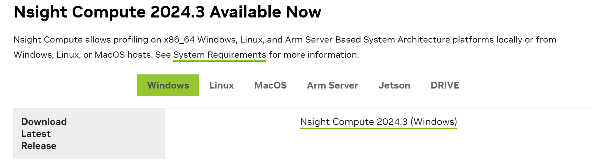
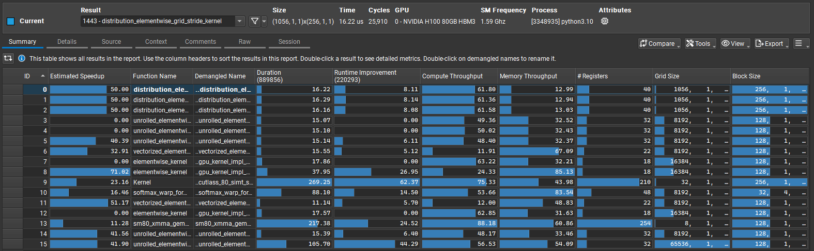
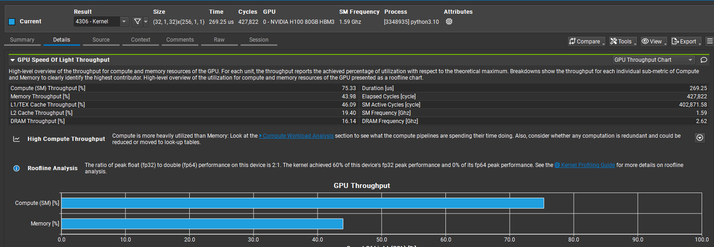
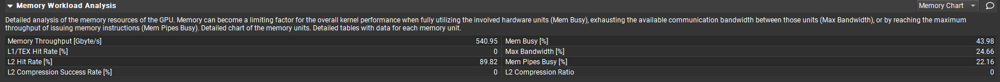
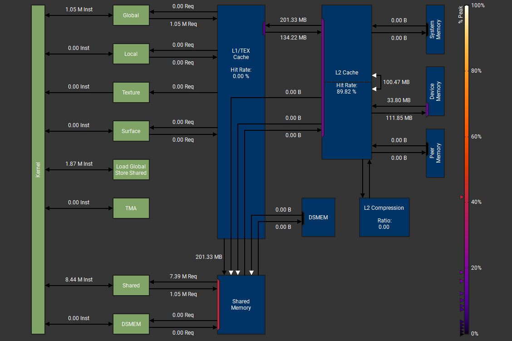

# ncu profile 的使用指南

## 1. ncu 的安装与profile生成
Nsight Compute安装包在 [https://developer.nvidia.com/tools-overview/nsight-compute/get-started](https://developer.nvidia.com/tools-overview/nsight-compute/get-started) 可以获得。


主要参考资料：https://docs.nvidia.com/nsight-compute/pdf/ProfilingGuide.pdf

可以通过`ncu --help`来查看ncu命令的参数
```
General Options:
  -h [ --help ]                         Print this help message.
  -v [ --version ]                      Print the version number.
  --mode arg (=launch-and-attach)       Select the mode of interaction with the target application:
                                          launch-and-attach
                                          (launch and attach for profiling)
                                          launch
                                          (launch and suspend for later attach)
                                          attach
                                          (attach to launched application)
  -p [ --port ] arg (=49152)            Base port for connecting to target application
  --max-connections arg (=64)           Maximum number of ports for connecting to target application
  --config-file arg (=1)                Use config.ncu-cfg config file to set parameters. Searches in the current 
                                        working directory and "$HOME/.config/NVIDIA Corporation" directory.
  --config-file-path arg                Override the default path for config file.

Launch Options:
  --check-exit-code arg (=1)            Check the application exit code and print an error if it is different than 0. 
                                        If set, --replay-mode application will stop after the first pass if the exit 
                                        code is not 0.
  --injection-path-32 arg (=../linux-desktop-glibc_2_11_3-x86)
                                        Override the default path for the 32-bit injection libraries.
  --injection-path-64 arg               Override the default path for the 64-bit injection libraries.
  --preload-library arg                 Prepend a shared library to be loaded by the application before the injection 
                                        libraries.
  --call-stack                          Enable CPU Call Stack collection.
  --nvtx                                Enable NVTX support.
  --support-32bit                       Support profiling processes launched from 32-bit applications.
  --target-processes arg (=all)         Select the processes you want to profile:
                                          application-only
                                          (profile only the application process)
                                          all
                                          (profile the application and its child processes)
  --target-processes-filter arg         Set the comma separated expressions to filter which processes are profiled.
                                          <process name> Set the exact process name to include for profiling.
                                          regex:<expression> Set the regex to include matching process names for 
                                        profiling.
                                            On shells that recognize regular expression symbols as special characters,
                                            the expression needs to be escaped with quotes.
                                          exclude:<process name> Set the exact process name to exclude for profiling.
                                          exclude-tree:<process name> Set the exact process name to exclude
                                            for profiling and further process tracking. None of its child processes
                                            will be profiled, even if they match a positive filter.
                                        The executable name part of the process will be considered in the match.
                                        Processing of filters stops at the first match.
                                        If any positive filter is specified, only processes matching a positive filter 
                                        are profiled.
  --null-stdin                          Launch the application with '/dev/null' as its standard input. This avoids 
                                        applications reading from standard input being stopped by SIGTTIN signals and 
                                        hanging when running as backgrounded processes.

Attach Options:
  --hostname arg                        Set hostname / ip address for connection target.

Common Profile Options:
 ...
```
在正常情况下，大多数参数并不需要使用，通常使用以下命令即可
```
ncu --set full -o *** python3 xxx.py
```
完成后会在服务器上产生一个 `***.ncu-rep` 文件, 可以在本地用 Nsight Compute 打开。

## 2. ncu profile 的分析
上一节介绍了 ncu 生成 profile 的方法，本节将以一个具体案例来介绍如何解读 profile。
在 `reference.py` 里实现了一个基本的 attention 结构，通过 `ncu -o attn_fwd --set full python test_attention.py`生成一个名为 `attn_fwd.ncu-rep` 的文件，生成过程的日志如下所示：
```
==PROF== Connected to process 3348935 (/usr/bin/python3.10)
==WARNING== Unable to access the following 6 metrics: ctc__rx_bytes_data_user.sum, ctc__rx_bytes_data_user.sum.pct_of_peak_sustained_elapsed, ctc__rx_bytes_data_user.sum.per_second, ctc__tx_bytes_data_user.sum, ctc__tx_bytes_data_user.sum.pct_of_peak_sustained_elapsed, ctc__tx_bytes_data_user.sum.per_second.

==PROF== Profiling "distribution_elementwise_grid..." - 0: 0%....50%....100% - 37 passes
==PROF== Profiling "distribution_elementwise_grid..." - 1: 0%....50%....100% - 37 passes
==PROF== Profiling "distribution_elementwise_grid..." - 2: 0%....50%....100% - 37 passes
==PROF== Profiling "unrolled_elementwise_kernel" - 3: 0%....50%....100% - 37 passes
==PROF== Profiling "unrolled_elementwise_kernel" - 4: 0%....50%....100% - 37 passes
==PROF== Profiling "unrolled_elementwise_kernel" - 5: 0%....50%....100% - 38 passes
==PROF== Profiling "vectorized_elementwise_kernel" - 6: 0%....50%....100% - 38 passes
==PROF== Profiling "elementwise_kernel" - 7: 0%....50%....100% - 38 passes
==PROF== Profiling "elementwise_kernel" - 8: 0%....50%....100% - 38 passes
==PROF== Profiling "Kernel" - 9: 0%....50%....100% - 37 passes
==PROF== Profiling "softmax_warp_forward" - 10: 0%....50%....100% - 37 passes
==PROF== Profiling "vectorized_elementwise_kernel" - 11: 0%....50%....100% - 37 passes
==PROF== Profiling "elementwise_kernel" - 12: 0%....50%....100% - 37 passes
==PROF== Profiling "sm80_xmma_gemm_f32f32_f32f32_..." - 13: 0%....50%....100% - 37 passes
==PROF== Profiling "unrolled_elementwise_kernel" - 14: 0%....50%....100% - 37 passes
==PROF== Profiling "unrolled_elementwise_kernel" - 15: 0%....50%....100% - 38 passes
==PROF== Disconnected from process 3348935
==PROF== Report: /share_data/data-before/zzd/repos/cuda_learning/05_cuda_mode/ncu_profile/attn_fwd.ncu-rep
```
使用 Nsight Compute 打开这个文件。


### **Summary**
从第一页看起，该页主要显示的是 summary， 其中序号 0-15 则是依次运算的kernel，其信息包括：
- ID: 每个函数的唯一标识符。
- Estimated Speedup: 估计的加速比，表示如果优化这个函数可能带来的速度提升。
- Function Name: 函数的名称。
- Demangled Name: 去掉修饰符的函数名称。
- Duration: 函数执行时间（以ns为单位）。
- Runtime Improvement: 估计的运行时间提示（以ns为单位），表示如果优化这个函数可能带来的运行时间提升。
- Compute Throughput: 计算吞吐量。SM 吞吐量假设在 SMSPs 间负载平衡理想的情况下 （此吞吐量指标表示在所有子单元实例的经过周期内达到的峰值持续率的百分比）。
- Memory Throughput: 内存吞吐量。计算内存管道吞吐量 （此吞吐量指标表示在所有子单元实例的经过周期内达到的峰值持续率的百分比）。
- Registers: 每个线程使用的寄存器数量。
- GridSize：kernel启动的网格大小。
- BlockSize：每个Block的线程数。
- Cycles：GPC指令周期。GPC：通用处理集群（General Processing Cluster）包含以 TPC（纹理处理集群）形式存在的 SM、纹理和 L1 缓存。 它在芯片上被多次复制。

最上部的`Result`默认显示的是`ID=0`的 kernel 运行的部分信息，包括GPU型号及频率。

从该图可以比较快速的得到一些信息：
- Memory-bound：Memory Throughput 明显高于 Compute Throughput 的 kernel ，例如 `ID=6,11`
- Compute-bound：Compute Throughput 明显高于 Memory Throughput 的 kernel ，例如 `ID=9,13`


### **Details**
上一部分概览了所有 kernel 的信息，本节将对某个具体kernel 进行详细分析，接下来 `ID=9` 的 kernel 为例进行说明。

#### **GPU Speed Of Light Throughput**

该指标可以详细看到 Compute 和 不同层次的 Memory 的实际利用效率的情况，由此可以定位其在 roofline 中的位置。

从这个结果可以看出：

- 计算吞吐量(75.33%)高于内存吞吐量(43.98%)，表明这可能是一个计算密集型任务。
- L2 缓存和 DRAM 吞吐量相对较低，可能存在优化空间。
- L1吞吐量与总体内存吞吐量相近，说明主要的内存操作与该部分交互，需要特别说明的是 Shared memory 也统计在内。




#### **Memory Workload Analysis**
该指标主要内存资源的使用情况，主要包括通信带宽、内存指令的最大吞吐量。详细的数据表如下：

- Memory Throughput: 540.95 Gbyte/s

即每秒在DRAM中访问的字节数。

- L1/TEX Hit Rate: 0

每个 sector 的 sector 命中次数 （这个比率指标表示跨所有子单元实例的值，以百分比表示）。

l1tex：一级（L1）/纹理缓存位于GPC内部。 它可以用作定向映射的共享内存和/或在其缓存部分存储全局、本地和纹理数据。

sector：缓存线或设备内存中对齐的32字节内存块。 一个L1或L2缓存线是四个sector，即128字节。 如果标签存在且sector数据在缓存线内，则sector访问被归类为命中。 标签未命中和标签命中但数据未命中都被归类为未命中。

解释一下这里的 Hit Rate 为什么是 0，可能有以下几种解释：

a) 如果加载指令缓存操作是 `ld.cg`, 该操作直接从 L2 缓存中读取数据，而不会访问 L1 缓存，因此 L1 缓存命中率是 0，依据在[这里](https://docs.nvidia.com/cuda/parallel-thread-execution/#cache-operators)。

b) Shared memory 的效率更高，并行度较低高的情况下主要使用 Shared memory，因此 L1 缓存命中率较低。从目前情况看该解释更合理，那么什么时候应该使用 L1 呢，可以关注[这里](https://forums.developer.nvidia.com/t/when-will-we-want-to-use-l1/303566?u=202476410arsmart)。

- L2 Hit Rate: 89.82%

L2sector查找命中的比例 （这个比率指标表示跨所有子单元实例的值，以百分比表示）。

l2s：二级（L2）缓存切片是二级缓存的一个子分区。 l2s_t 指的是其标签阶段。 l2s_m 指的是其未命中阶段。 l2s_d 指的是其数据阶段。



- Mem Busy: 43.98%

缓存和DRAM内部活动的吞吐量（这个吞吐量指标表示在所有子单元实例的经过周期内达到的峰值持续速率的百分比）

- Max Bandwidth: 24.66%

SM<->缓存<->DRAM之间互连的吞吐量 （这个吞吐量指标表示在所有子单元实例的经过周期内达到的峰值持续速率的百分比）

- L2 Compression Ratio: 0

- L2 Compression Success Rate: 0

**Memory Chart图分析**
改图显示了各级 memory 的连接关系及使用情况，整体情况一目了然。




